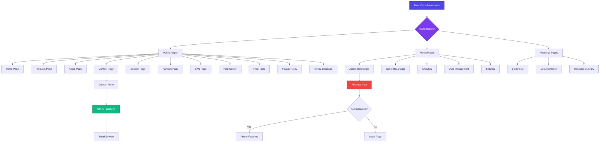
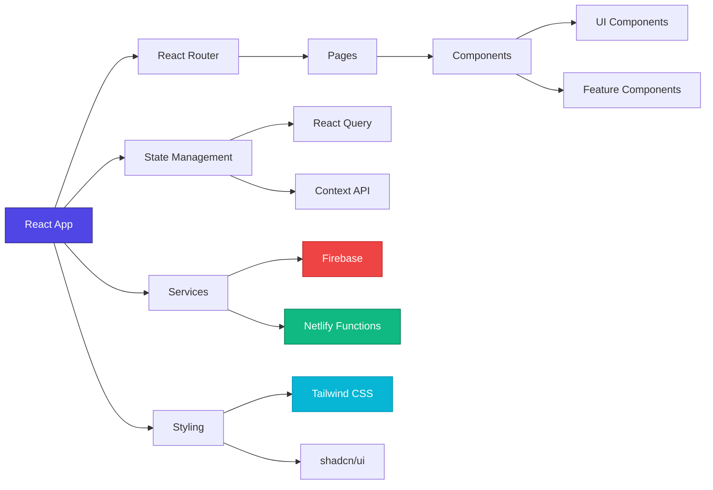
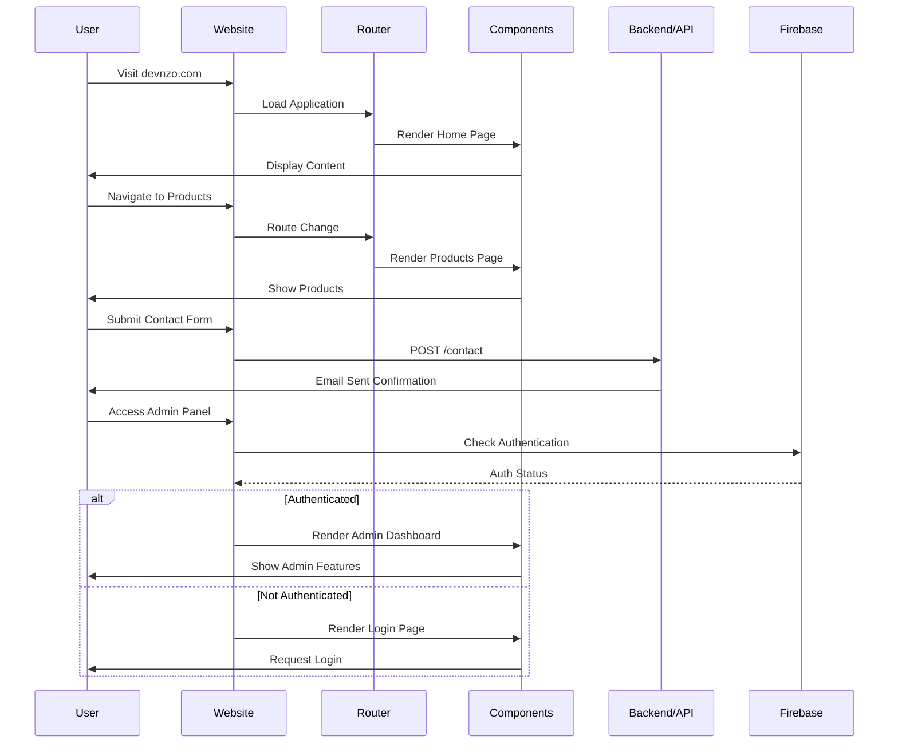

# Devnzo Website

> A modern, full-featured website built with React, TypeScript, and Vite

## 📊 Project Flow Diagram



## 🏗️ Architecture Overview



## 🔄 User Journey Flow



## 📁 Project Structure

```
devnzo-website/
├── src/
│   ├── components/          # Reusable UI components (73 components)
│   │   ├── ui/             # shadcn/ui components
│   │   └── features/       # Feature-specific components
│   ├── pages/              # Page components (29 pages)
│   │   ├── admin/          # Admin panel pages (11 pages)
│   │   ├── blog/           # Blog pages
│   │   ├── docs/           # Documentation pages
│   │   └── resources/      # Resource pages
│   ├── contexts/           # React Context providers
│   ├── hooks/              # Custom React hooks
│   ├── lib/                # Utility libraries
│   ├── types/              # TypeScript type definitions
│   ├── utils/              # Helper functions
│   ├── App.tsx             # Main application component
│   └── main.tsx            # Application entry point
├── netlify/
│   └── functions/          # Serverless functions
├── public/                 # Static assets
└── package.json            # Dependencies and scripts
```

## 🛠️ Tech Stack

### Frontend
- **React 18.3** - UI library
- **TypeScript 5.8** - Type safety
- **Vite 5.4** - Build tool and dev server
- **React Router 6.30** - Client-side routing
- **Tailwind CSS 3.4** - Utility-first CSS
- **shadcn/ui** - Component library built on Radix UI

### State Management
- **TanStack Query 5.83** - Server state management
- **React Context API** - Global state

### Rich Text Editor
- **TipTap 3.14** - WYSIWYG editor
  - Image extension
  - Link extension
  - Starter kit

### Backend Services
- **Firebase 12.7** - Authentication & Database
- **Netlify Functions** - Serverless API endpoints

### UI Components & Libraries
- **Radix UI** - Accessible component primitives
- **Lucide React** - Icon library
- **React Hook Form** - Form management
- **Zod** - Schema validation
- **Recharts** - Data visualization
- **date-fns** - Date utilities

### Development Tools
- **ESLint** - Code linting
- **TypeScript ESLint** - TypeScript-specific linting
- **PostCSS** - CSS processing
- **Autoprefixer** - CSS vendor prefixing

## 🚀 Getting Started

### Prerequisites
- Node.js (v18 or higher)
- npm or yarn

### Installation

```bash
# Clone the repository
git clone https://github.com/MuziDev495/devnzo-website.git

# Navigate to project directory
cd devnzo-website

# Install dependencies
npm install

# Start development server
npm run dev
```

### Available Scripts

```bash
npm run dev          # Start development server
npm run build        # Build for production
npm run build:dev    # Build for development
npm run preview      # Preview production build
npm run lint         # Run ESLint
```

## 🌐 Deployment

This project is configured for deployment on **Netlify**.

### Deploy Steps:
1. Push your code to GitHub
2. Connect your repository to Netlify
3. Configure build settings:
   - **Build command:** `npm run build`
   - **Publish directory:** `dist`
4. Deploy!

### Environment Variables
Make sure to set up the following environment variables in your Netlify dashboard:
- Firebase configuration
- API keys
- Other sensitive credentials

## 📝 Features

### Public Features
- ✅ Responsive homepage with modern design
- ✅ Product showcase pages
- ✅ About and company information
- ✅ Contact form with email integration
- ✅ Support and help center
- ✅ FAQ section
- ✅ Blog and resources
- ✅ Privacy policy and terms of service

### Admin Features
- ✅ Secure authentication with Firebase
- ✅ Content management system
- ✅ Analytics dashboard
- ✅ User management
- ✅ Settings and configuration

### Technical Features
- ✅ Server-side rendering ready
- ✅ SEO optimized
- ✅ Mobile-first responsive design
- ✅ Dark mode support (next-themes)
- ✅ Form validation with Zod
- ✅ Toast notifications (Sonner)
- ✅ Accessible components (Radix UI)
- ✅ Type-safe development (TypeScript)

## 🤝 Contributing

Contributions are welcome! Please feel free to submit a Pull Request.

## 📄 License

This project is private and proprietary.

## 📞 Contact

For questions or support, visit [devnzo.com](https://devnzo.com) or use the contact form on the website.

---

**Built with ❤️ by the Devnzo Team**
